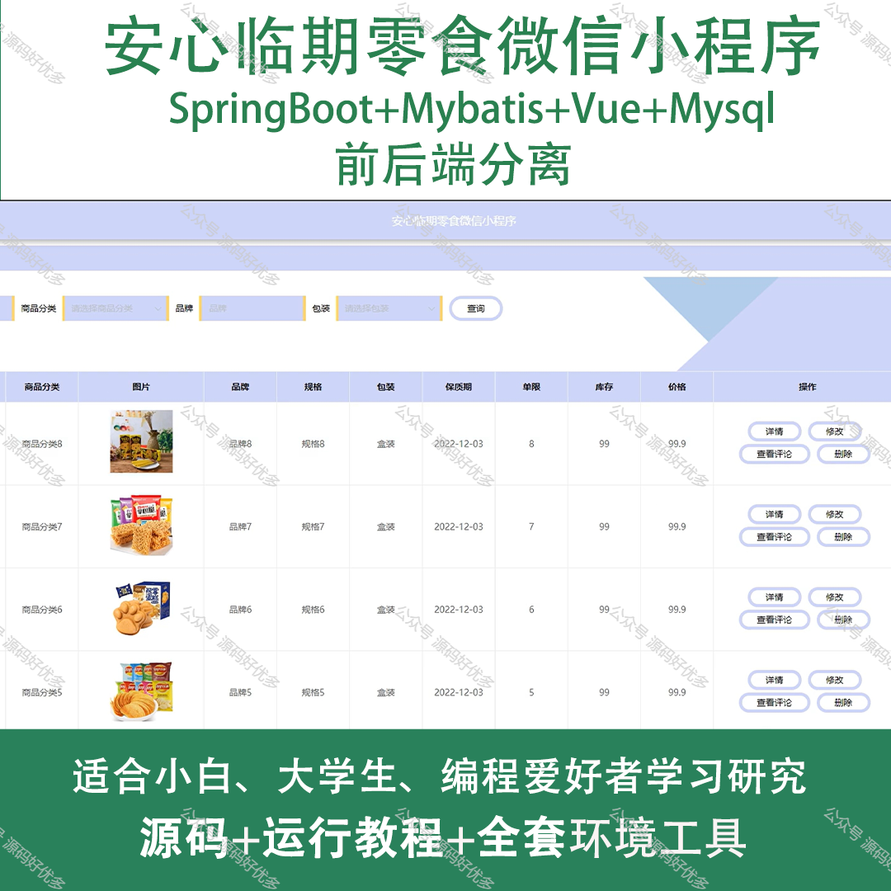
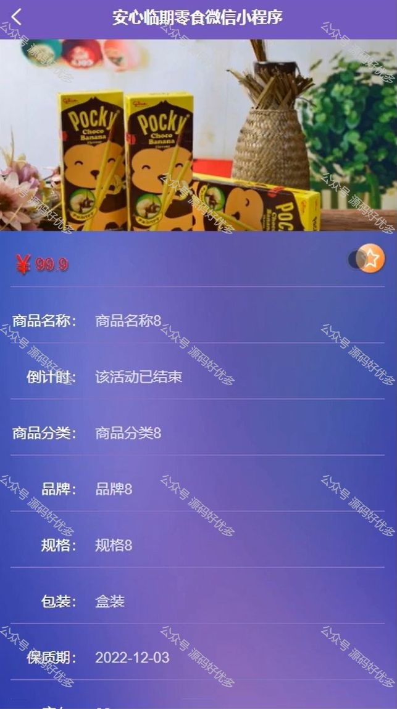
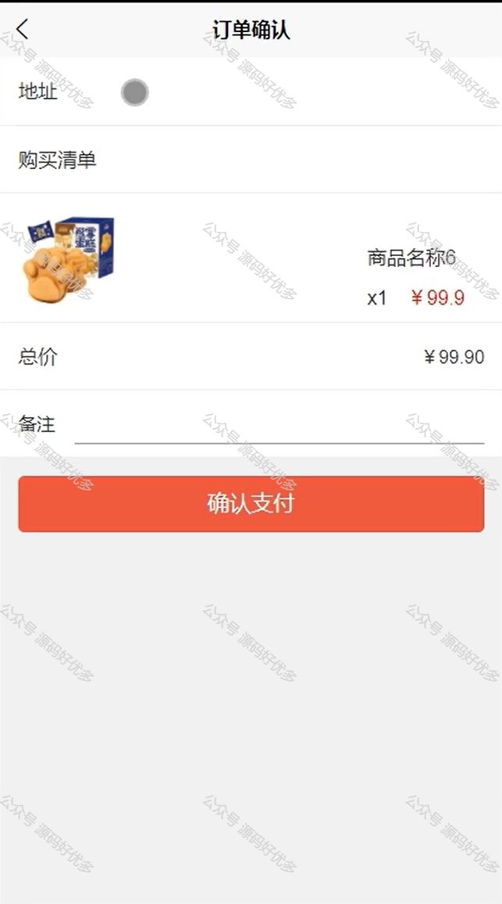
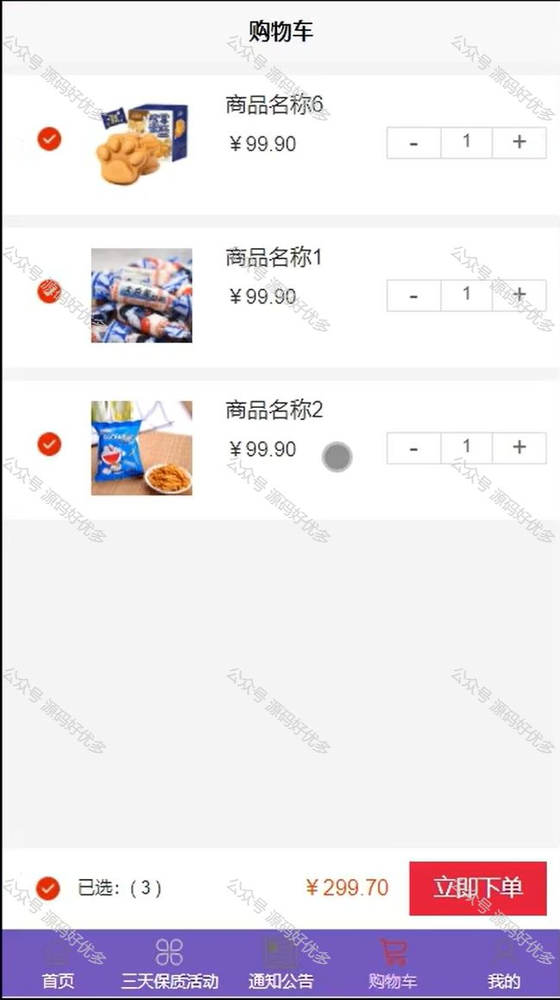
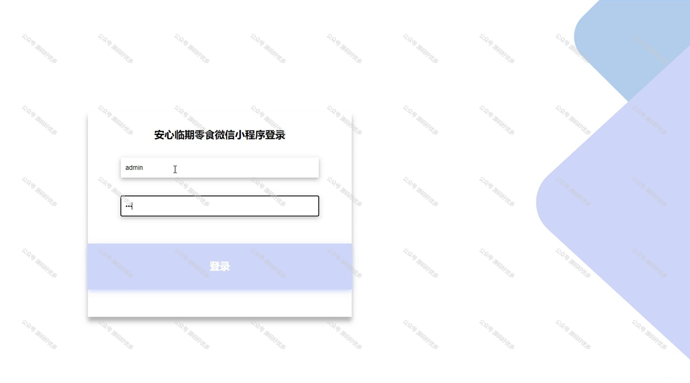
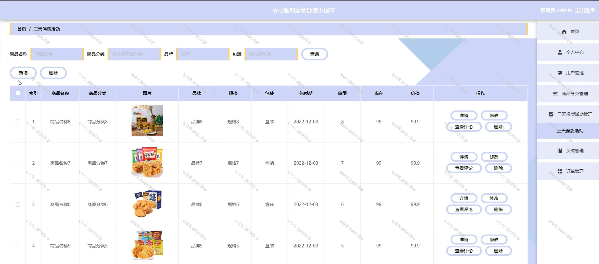
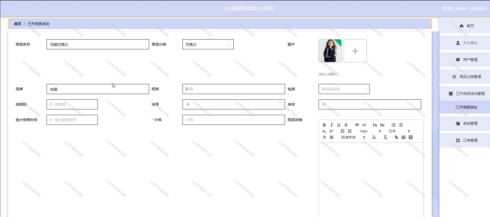

 
## 查看主页获取源码

> **作者介绍**： **✌**全网粉丝10W+本平台特邀作者、博客专家、CSDN新星计划导师、java领域优质创作者,博客之星、掘金/华为云/阿里云/InfoQ等平台优质作者、专注于项目实战 **✌**

  

### 一、作品包含

源码+数据库+全套环境和工具资源+部署教程

### 二、项目技术

前端技术：Html、Css、Js、Vue、Element-ui

数据库：MySQL

后端技术：Java、Spring Boot、MyBatis

  

### 三、运行环境

开发工具：IDEA/eclipse + 微信开发者工具

数据库：MySQL5.7

数据库管理工具：Navicat10以上版本

环境配置软件： JDK1.8+Maven3.6.3

前端Nodejs：14

### 四、项目介绍
项目编号：mpweixinA012

"安心临期零食"微信小程序，专注于为消费者提供安全、放心的临期零食购买体验。我们精选即将到达保质期但品质依旧优良的零食，通过严格的质量把控，确保每一件商品都能让顾客买得安心、吃得放心。在这里，您可以用更实惠的价格享受到高品质的零食，同时为减少食品浪费贡献一份力量。让我们一起开启健康、经济的美食之旅，让临期零食也能成为您的美味选择。

前台用户功能：登录注册、首页、三天保质活动、通知功能、购物车、个人中心、我的收藏、用户充值、在线客服、我的订单。

后台管理员的功能：登录、首页、个人中心、用户管理、商品分类管理、三天保质活动管理、系统管理、订单管理。

### 五、运行截图

  
